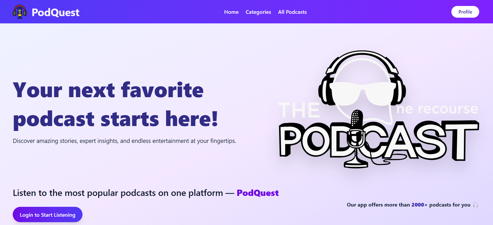
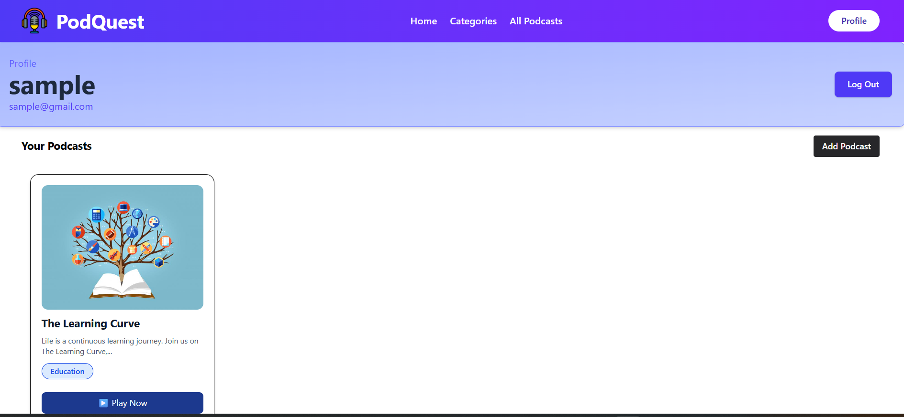
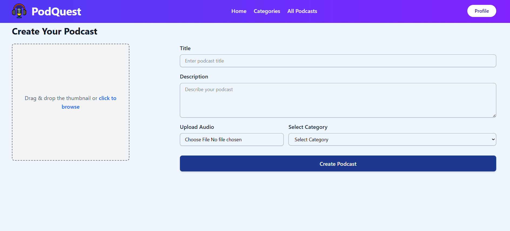
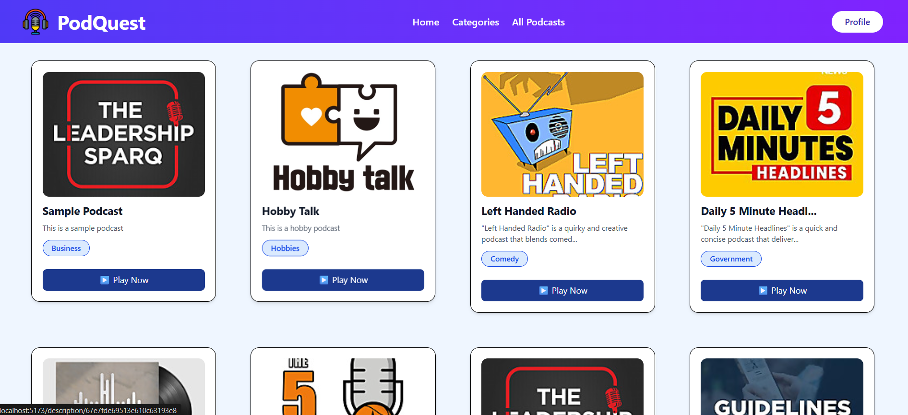
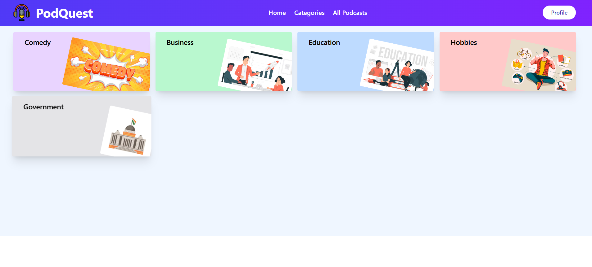
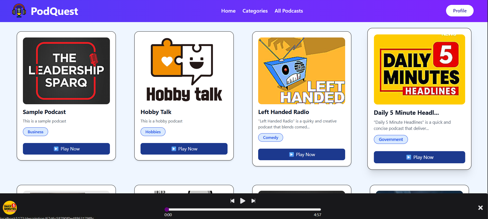
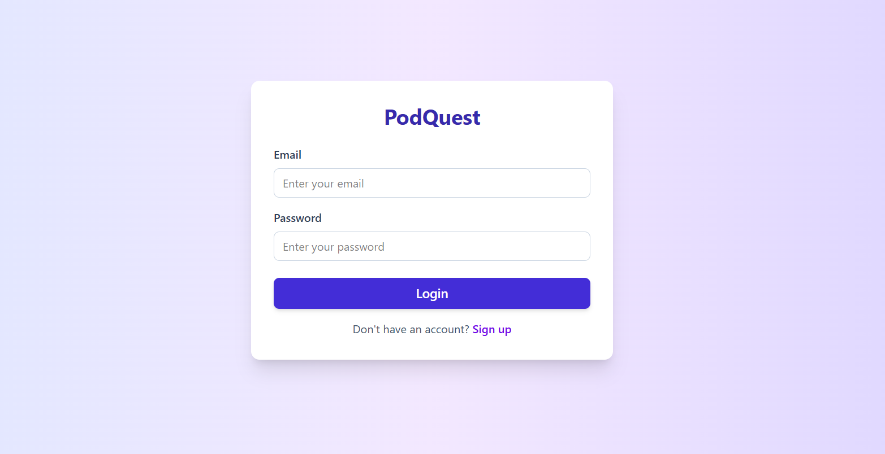

# 🎙️ PodQuest – MERN Stack Podcast Platform

**PodQuest** is a full-stack podcast hosting and streaming platform built using the **MERN (MongoDB, Express, React, Node.js)** stack. It enables users to **add, browse, categorize, and listen to podcasts**, while managing their profiles with secure **authentication and authorization**. The project is designed to be scalable and responsive with a clean and intuitive UI.

---

## 🌟 Features

- 🔐 **User Authentication & Authorization** (JWT-based)
- 📝 **Add Podcast** with title, category, and description
- 📚 **Podcast Categories** for better discoverability
- 🎧 **View All Podcasts** with player integration
- 👤 **Profile Section** to view and manage user info
- 🔍 **Detailed Podcast View** with streamable audio
- ⚙️ Protected Routes & Role-based Access Control
- 🧼 Clean and Minimal UI with Responsive Design

---

## 🛠️ Tech Stack

| Frontend | Backend | Database | Authentication |
|----------|---------|----------|----------------|
| React.js | Node.js | MongoDB  | JWT + Bcrypt   |
| Redux    | Express | Mongoose | Cookies        |
| React-Router | REST API | Cloudinary (for audio/image upload) | |

---

## 🖥️ UI Screenshots

### 🏠 Home Page

The landing page provides a welcoming introduction to the PodQuest platform, showcasing featured podcasts, categories, and a call to action for users to explore or upload podcasts.

---

### 👤 Profile Section

Displays user details, their uploaded podcasts, and options to update profile settings or logout.

---

### 📥 Add Podcast Page

Users can upload their podcasts with metadata such as title, category, and description, and even attach audio files.

---

### 📻 All Podcast Listing

Displays all podcasts uploaded by users. Includes filters and sorting by popularity, recency, and category.

---

### 🗂️ Category-wise Podcast View

Organizes podcasts into specific categories like Business, Education, Tech, etc., making it easier for users to discover content based on interest.

---

### 🎙️ Podcast Playback Page

A dedicated page to listen to individual podcast episodes with playback controls and episode metadata.

---

### 🔐 Login Page

Users can log in securely using their credentials. JWT-based authentication ensures secure access to personal features and podcast uploads.

---

